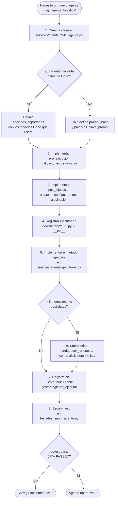

# FLOW: Cómo registrar un nuevo agente en el sistema

> **Audiencia:** desarrolladores que necesitan añadir un dominio de negocio nuevo al sistema multi-agente.  
> **Tiempo estimado:** 45–90 minutos para un agente funcional completo.  
> **Versión:** v9.0

---

## Diagrama de decisión



---

## Paso a paso detallado

### Paso 1 — Crear la clase del agente

Archivo: `services/agents/multi_agente.py`

```python
class AgenteLogistica(AgenteEspecializadoBase):
    """Experto en logística, transportes y trazabilidad de envíos."""
    id_agente = "agente_logistica"
    prompt_base = (
        "Eres un experto en logística con 20+ años de experiencia. "
        "Solo respondes con datos verificables. Nunca inventas rutas ni tiempos de entrega."
    )
    acciones_soportadas = {
        'consultar_envios', 'estado_pedido', 'analisis_entregas',
        'rutas_criticas', 'productos_en_transito',
    }
    palabras_clave_prompt = {
        'envío', 'envios', 'entrega', 'entregas', 'logística', 'transporte',
        'pedido', 'ruta', 'trazabilidad', 'despacho', 'guía',
    }
```

**Reglas obligatorias:**
- `id_agente` debe ser único en todo el sistema (verificar lista en el archivo)
- `acciones_soportadas` debe usar nombres snake_case consistentes con `nlp_avanzado.py`
- `palabras_clave_prompt` son las palabras que el sistema usa para asignar score al agente

---

### Paso 2 — pre_ejecucion (guardia de dominio)

```python
def pre_ejecucion(self, consulta: Any, mensaje: str) -> ResultadoPreEjecucion:
    advertencias = []
    
    # Validar que viene con temporalidad si la necesita
    temp = getattr(consulta, 'temporalidad', {}) or {}
    if not temp.get('fecha_inicio'):
        hoy = datetime.now()
        temp['fecha_inicio'] = (hoy - timedelta(days=30)).strftime('%Y-%m-%d')
        temp['fecha_fin'] = hoy.strftime('%Y-%m-%d')
        consulta.temporalidad = temp
        advertencias.append('temporalidad_default_30_dias')
    
    return ResultadoPreEjecucion(
        permitido=True,
        consulta=consulta,
        advertencias=advertencias,
        confianza_agente=0.88  # Ajustar según solidez del dominio
    )
```

---

### Paso 3 — post_ejecucion (anti-alucinación)

```python
def post_ejecucion(self, consulta, respuesta, df, error=False):
    resultado = super().post_ejecucion(consulta, respuesta, df, error)
    
    # Ejemplo: bajar confianza si no hay datos de envío
    if df is None or (hasattr(df, 'empty') and df.empty):
        resultado.confianza_datos = min(resultado.confianza_datos, 0.40)
        resultado.observaciones.append("sin_datos_logistica_verificar_modelo_stock_picking")
    
    return resultado
```

---

### Paso 4 — Registrar ejecutor en `interfaz_v5.py`

Buscar el bloque `registrar_ejecutor` en `OdooAIProV5.__init__()` y añadir:

```python
self.gestor_agentes.registrar_ejecutor(
    'agente_logistica',
    self._ejecutores._ejecutor_logistica
)
```

---

### Paso 5 — Implementar el método ejecutor

Archivo: `services/agents/ejecutores.py`

```python
def _ejecutor_logistica(
    self, consulta: ConsultaEntendida, mensaje: str
) -> Tuple[str, Optional[pd.DataFrame]]:
    """Ejecutor del agente de logística."""
    accion = consulta.accion_sugerida
    
    if accion == 'consultar_envios':
        df = self._bot.odoo.buscar(
            modelo='stock.picking',
            filtros=[('state', 'not in', ['done', 'cancel'])],
            campos=['name', 'partner_id', 'scheduled_date', 'state'],
            limite=50
        )
        if df is not None and not df.empty:
            return self._bot.fmt.formatear_tabla(df, titulo="Envíos Pendientes"), df
        return "No se encontraron envíos pendientes.", None
    
    return f"Acción '{accion}' no implementada en agente_logistica.", None
```

---

### Paso 6 — enriquecer_respuesta (opcional)

Solo necesario si el agente aporta análisis que no proviene de una simple tabla:

```python
def enriquecer_respuesta(self, consulta, respuesta, df, mensaje=""):
    if df is None or df.empty:
        return respuesta
    
    # Calcular % de envíos con retraso (análisis determinista sobre datos reales)
    if 'scheduled_date' in df.columns:
        hoy = pd.Timestamp.now()
        atrasados = (pd.to_datetime(df['scheduled_date']) < hoy).sum()
        pct = (atrasados / len(df)) * 100
        respuesta += f"\n\n📊 **{atrasados} envíos atrasados** ({pct:.1f}% del total)"
    
    return respuesta
```

---

### Paso 7 — Añadir intenciones al NLP (si son nuevas)

Si las acciones son completamente nuevas (no existen en `nlp_avanzado.py`):

1. Abrir `services/nlp/nlp_avanzado.py`
2. Buscar el dict `INTENCIONES_ACCIONES` o equivalente
3. Añadir las nuevas acciones con sus palabras trigger
4. Regenerar embeddings si el sistema los usa: `data/embeddings_cache/`

---

### Paso 8 — Escribir tests

Archivo: `tests/test_multi_agente.py`

```python
def test_agente_logistica_score_prompt():
    agente = AgenteLogistica()
    assert agente.score_prompt("¿Cuántos envíos están pendientes?") > 0.3

def test_agente_logistica_soporta_accion():
    agente = AgenteLogistica()
    assert agente.soporta_accion('consultar_envios')
    assert not agente.soporta_accion('consultar_ventas')

def test_agente_logistica_pre_ejecucion(consulta_mock):
    agente = AgenteLogistica()
    resultado = agente.pre_ejecucion(consulta_mock, "envíos de este mes")
    assert resultado.permitido is True
```

---

## Checklist final

- [ ] `id_agente` único y en snake_case
- [ ] `acciones_soportadas` mapeadas con `nlp_avanzado.py`
- [ ] `pre_ejecucion` validada con al menos 1 regla de dominio
- [ ] `post_ejecucion` ajusta confianza según calidad de datos
- [ ] Ejecutor registrado en `interfaz_v5.py`
- [ ] Método `_ejecutor_*` implementado en `ejecutores.py`
- [ ] Contrato cumplido: clase satisface `AgenteEspecializadoProtocol` de `core/contratos.py`
- [ ] Tests pasan: `pytest tests/test_multi_agente.py -v`
