# FLOW: Pipeline Principal — Entrada → Respuesta

> **Audiencia:** desarrolladores que onboardean al proyecto o debuggean el pipeline completo.  
> **Regla:** cada caja de este diagrama es un módulo real en el código; nada es conceptual.  
> **Fase 3:** el pipeline es alcanzable vía `POST /chat` (FastAPI `app/api/routers/chat.py`) o directamente desde `procesar_mensaje()`.  
> **Fase 5:** cada request a `POST /chat` requiere Bearer token válido — `get_current_user` se ejecuta antes de que el mensaje llegue al pipeline.

---

## Diagrama general

```mermaid
flowchart TD
    A([Usuario envía mensaje]) --> B[procesar_mensaje\nviews/interfaz_v5.py]

    B --> C{Rate limit\n≤30 req/min?}
    C -- No --> ERR1([⚠️ Respuesta: rate limit])
    C -- Sí --> D[Truncar a MAX 2000 chars\nprotección DoS]

    D --> E{NormalizadorPrompt\ndisponible?}
    E -- Sí --> F[Normalizar: typos,\nabreviaciones, coloquialismos\nutils/normalizador_prompt.py]
    E -- No --> G
    F --> G{Motor Empático\nmotor_empatico.py}

    G -- saludo/despedida --> H([Respuesta empática directa\nsin pasar por NLP])
    G -- mensaje emocional --> I[Adjuntar empatía\n+ continuar pipeline]
    G -- neutro --> J

    I --> J[MotorNLPAvanzado.entender\nservices/nlp/nlp_avanzado.py]

    J --> K{Confianza ≥ umbral\n0.58 por default?}
    K -- No --> L([Fallback estructurado\ncon sugerencias])
    K -- Sí --> M{¿Acción crítica?\nconfirmación pendiente?}

    M -- Sí + pendiente --> N[_resolver_confirmacion_critica\nespera sí/no del usuario]
    N --> O
    M -- No --> O[_detectar_agente_especializado\nGestorMultiAgente.resolver_agente]

    O --> P[AgenteEspecializadoBase.pre_ejecucion\nvalidación por dominio]
    P -- bloqueado --> ERR2([Respuesta: consulta no permitida])
    P -- permitido --> Q[_ejecutar_accion\najusta parámetros y llama conector]

    Q --> R[ConectorOdoo.buscar / buscar_leer\nmodels/conector_odoo.py]
    R --> R1[AuditoriaQueries.registrar_query\nservices/security/auditoria_queries.py]
    R1 --> S[(Odoo ERP\nRPC/JSON)]

    S --> T[DataFrame de resultados]
    T --> U[AgenteEspecializadoBase.enriquecer_respuesta\nañade análisis de dominio]

    U --> V{¿Es cadena\nmulti-agente?}
    V -- Sí --> W[GestorMultiAgente.ejecutar_cadena_completa\ncada agente enriquece en secuencia]
    V -- No --> X

    W --> X[AgenteEspecializadoBase.post_ejecucion\najusta confianza_datos]

    X --> Y{LLM disponible\nY confianza < 0.75?}
    Y -- Sí --> Z[AgenteAndromeda.generar_respuesta\nservices/llm/cerebro_llm.py]
    Y -- No --> AA

    Z --> AA[_validar_y_regenerar_respuesta\nutils/validador_respuestas.py]
    AA --> AB{¿Respuesta válida\ny confianza ≥ 0.78?}
    AB -- No, hasta 3 reintentos --> AA
    AB -- Sí --> AC[Memoria Jerárquica\nregistrar_interaccion]

    AC --> AD[LoggerAvanzado.registrar_prompt\nutils/logging_avanzado.py]
    AD --> AE([Respuesta final al usuario])
```

---

## Descripción por etapa

### 1. Entrada y protección
- **Módulo:** `views/interfaz_v5.py → OdooAIProV5.procesar_mensaje()`
- Rate limiting: 30 req/min por sesión (lista de timestamps en memoria)
- Truncado a 2 000 chars para proteger contra inputs maliciosos

### 2. Normalización del prompt
- **Módulo:** `utils/normalizador_prompt.py → NormalizadorPrompt`
- Corrige ortografía, abreviaciones y coloquialismos antes de que el NLP los vea
- Es opcional: si falla, el sistema continúa con el mensaje original (degradación graceful)

### 3. Motor Empático
- **Módulo:** `services/nlp/motor_empatico.py → MotorEmpatico`
- Detecta saludos, despedidas y mensajes emocionales
- Los saludos/despedidas se resuelven aquí sin pasar por NLP (ruta corta)

### 4. NLP Avanzado
- **Módulo:** `services/nlp/nlp_avanzado.py → MotorNLPAvanzado`
- Retorna `ConsultaEntendida` con: `intencion_principal`, `accion_sugerida`, `confianza`, `entidades`, `parametros`
- Si `confianza < umbral` → fallback con sugerencias, sin ejecutar nada

### 5. Router de intención y agente
- **Módulo:** `services/agents/multi_agente.py → GestorMultiAgente`
- `resolver_agente(accion, mensaje)` → asigna el agente especializado de mayor score
- Acciones críticas disparan flujo de confirmación explícita

### 6. Pre-ejecución del agente
- **Módulo:** `AgenteEspecializadoBase.pre_ejecucion()` en cada agente
- Puede bloquear consultas fuera de dominio o marcarlas con advertencias
- Resultado: `ResultadoPreEjecucion(permitido=True/False)`

### 7. Ejecución y consulta al ERP
- **Módulos:** `services/actions/ejecutor_acciones.py`, `models/conector_odoo.py`
- Toda query pasa por `validar_query()` (sandbox) antes de tocar Odoo
- Cada query se registra en `AuditoriaQueries` con hash_prompt

### 8. Enriquecimiento multi-agente
- Cada agente puede añadir análisis determinista sobre el DataFrame real
- Si es cadena multi-agente, varios agentes enriquecen en secuencia

### 9. Validación de respuesta
- **Módulo:** `utils/validador_respuestas.py → ValidadorRespuestas`
- Hasta 3 reintentos para alcanzar `confianza ≥ 0.78` y respuesta válida
- Si LLM está activo y confianza es baja, se usa para regenerar

### 10. Memoria y logging
- Cada interacción se persiste en `MemoriaJerarquica` (sesión + semántica)
- `LoggerAvanzado` registra: prompt, respuesta, intención, confianza, duración

---

## Archivos clave del pipeline

| Etapa | Archivo |
|-------|---------|
| Entrada/orquestación | `views/interfaz_v5.py` |
| Normalización | `utils/normalizador_prompt.py` |
| NLP | `services/nlp/nlp_avanzado.py` |
| Multi-agente | `services/agents/multi_agente.py` |
| Ejecución acciones | `services/actions/ejecutor_acciones.py` |
| Conector ERP | `models/conector_odoo.py` |
| Auditoría | `services/security/auditoria_queries.py` |
| Validación respuesta | `utils/validador_respuestas.py` |
| LLM | `services/llm/cerebro_llm.py` |
| Memoria | `services/memory/memoria_jerarquica.py` |
| Contratos | `core/contratos.py` |
