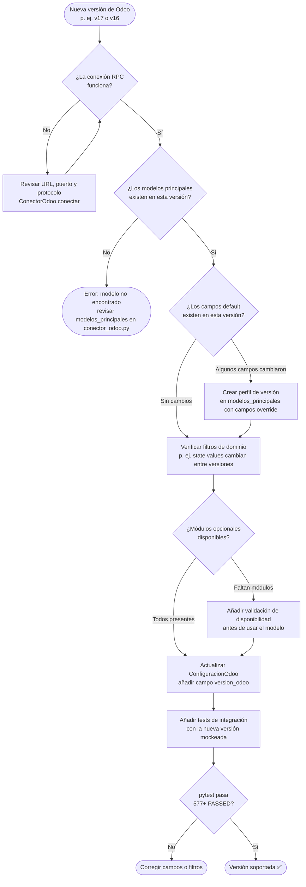

# FLOW: Cómo agregar soporte a una nueva versión de Odoo

> **Audiencia:** desarrolladores que deben integrar una instalación de Odoo con versión diferente a las actualmente soportadas (v14–v19+).  
> **Contexto:** el sistema usa RPC JSON via `odoorpc`. Los modelos y campos son en su mayoría compatibles entre versiones de Odoo, pero pueden existir diferencias en nombres de campos, módulos opcionales y comportamiento de filtros.  
> **Versión:** v9.0

---

## Diagrama de decisión



---

## Paso a paso detallado

### Paso 1 — Verificar conectividad

El conector usa `odoorpc` con auto-detección de SSL:

```python
# models/conector_odoo.py → ConectorOdoo.conectar()
url = self.config.url
host = url.replace('https://', '').replace('http://', '').split(':')[0]
port = 443 if 'https' in url else 80
protocol = 'jsonrpc+ssl' if 'https' in url else 'jsonrpc'
```

Para Odoo **Community on-premise** (sin HTTPS) en puerto no estándar:
```json
{
  "url": "http://192.168.1.10:8069",
  "db": "mi_empresa",
  "usuario": "admin",
  "password": "clave"
}
```

---

### Paso 2 — Verificar modelos principales

Cada versión de Odoo puede renombrar o dividir modelos. La tabla de mapeo está en:

**Archivo:** `models/conector_odoo.py → ConectorOdoo.__init__() → self.modelos_principales`

| Clave interna | Modelo Odoo | Notas de versión |
|---|---|---|
| `ventas` | `sale.order` | Estable v14–v17 |
| `plantillas` | `product.template` | Estable v14–v17 |
| `stock` | `stock.quant` | Estable v14–v17 |
| `clientes` | `res.partner` | Estable, `customer_rank` añadido en v13 |
| `facturas` | `account.move` | Renombrado desde `account.invoice` en v13 |
| `compras` | `purchase.order` | Estable v14–v17 |
| `empleados` | `hr.employee` | Requiere módulo `hr` instalado |

**Cómo añadir un override de campos por versión:**

```python
# En ConectorOdoo.__init__, ampliar modelos_principales:
self.modelos_principales = {
    'ventas': {
        'modelo': 'sale.order',
        'campos_default': ['name', 'partner_id', 'date_order', 'amount_total', 'state'],
        'campo_fecha': 'date_order',
        # Override por versión: campos que cambian entre versiones
        'campos_v17': ['name', 'partner_id', 'date_order', 'amount_total', 'state', 'invoice_status'],
    },
    ...
}
```

Para seleccionar automáticamente:
```python
def _campos_para_modelo(self, clave_modelo: str) -> List[str]:
    info = self.modelos_principales.get(clave_modelo, {})
    version_key = f"campos_v{self.config.version_odoo}"
    return info.get(version_key) or info.get('campos_default', [])
```

---

### Paso 3 — Verificar filtros de dominio

Los valores del campo `state` pueden diferir entre versiones:

| Versión | `sale.order.state` válidos |
|---|---|
| v14, v15 | `draft`, `sent`, `sale`, `done`, `cancel` |
| v16, v17 | `draft`, `sent`, `sale`, `done`, `cancel` (sin cambios) |
| v14, v15 | `account.move.state`: `draft`, `posted`, `cancel` |

Revisar los filtros hardcodeados en `services/actions/ejecutor_acciones.py` y en agentes.

---

### Paso 4 — Actualizar ConfiguracionOdoo

**Archivo:** `app/config.py` o `models/conector_odoo.py`

Añadir el campo `version_odoo` al dataclass:

```python
@dataclass
class ConfiguracionOdoo:
    url: str
    db: str
    usuario: str
    password: str
    version_odoo: int = 17  # ← añadir con default a la versión principal
```

En el JSON de configuración:
```json
{
  "url": "https://mi-empresa.odoo.com",
  "db": "produccion",
  "usuario": "bot@empresa.com",
  "password": "api-key-aqui",
  "version_odoo": 16
}
```

---

### Paso 5 — Validar módulos opcionales

Algunos modelos solo existen si el módulo está instalado:

```python
# Patrón recomendado antes de usar un modelo que puede no existir:
def _modelo_disponible(self, nombre_modelo: str) -> bool:
    """Verifica si un modelo existe en esta instalación de Odoo."""
    try:
        self.odoo.env[nombre_modelo].fields_get(['id'])
        return True
    except Exception:
        return False
```

Módulos y sus modelos:

| Módulo Odoo | Modelos que habilita |
|---|---|
| `sale` | `sale.order`, `sale.order.line` |
| `purchase` | `purchase.order` |
| `stock` | `stock.quant`, `stock.picking` |
| `account` | `account.move`, `account.payment` |
| `hr` | `hr.employee`, `hr.attendance` |
| `point_of_sale` | `pos.order`, `pos.session` |
| `crm` | `crm.lead` |

---

### Paso 6 — Whitelist del sandbox

El `utils/validador_queries.py` tiene una whitelist de modelos permitidos. Al añadir soporte a nuevos modelos de una versión, actualizar la whitelist:

**Archivo:** `utils/validador_queries.py`

```python
MODELOS_PERMITIDOS = {
    'sale.order', 'sale.order.line',
    'product.product', 'product.template',
    'stock.quant', 'stock.picking',
    'res.partner',
    'account.move', 'account.move.line',
    'purchase.order',
    'hr.employee', 'hr.attendance',
    'pos.order', 'pos.session',
    'crm.lead',
    # ← añadir nuevos modelos aquí
}
```

---

### Paso 7 — Tests

Añadir fixtures mockeados de la nueva versión en `tests/conftest.py`:

```python
@pytest.fixture
def conector_odoo_v16(mocker):
    """Mock de ConectorOdoo configurado para Odoo v16."""
    conector = MagicMock()
    conector.conectado = True
    conector.config.version_odoo = 16
    # Datos de ejemplo específicos de v16 si hay diferencias
    conector.buscar.return_value = pd.DataFrame({
        'name': ['S00001'], 'amount_total': [1000.0], 'state': ['sale']
    })
    return conector
```

---

## Checklist final

- [ ] Conexión RPC verificada con la nueva versión
- [ ] `modelos_principales` revisados y actualizados si hay diferencias
- [ ] Filtros de dominio (`state`, etc.) verificados para esta versión  
- [ ] `ConfiguracionOdoo.version_odoo` configurado
- [ ] Modelos opcionales protegidos con `_modelo_disponible()`
- [ ] Whitelist de `validador_queries.py` actualizada con nuevos modelos
- [ ] Tests con fixtures mockeados de la nueva versión
- [ ] `pytest` pasa completo: `443+ PASSED`
