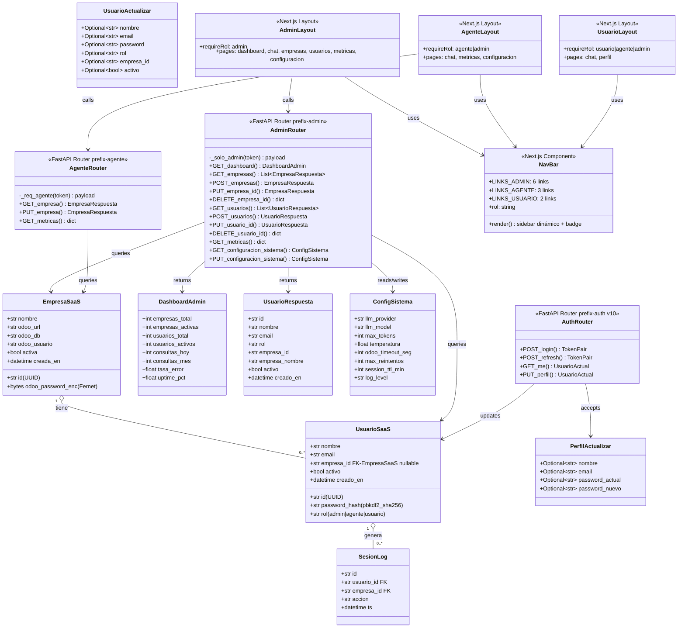
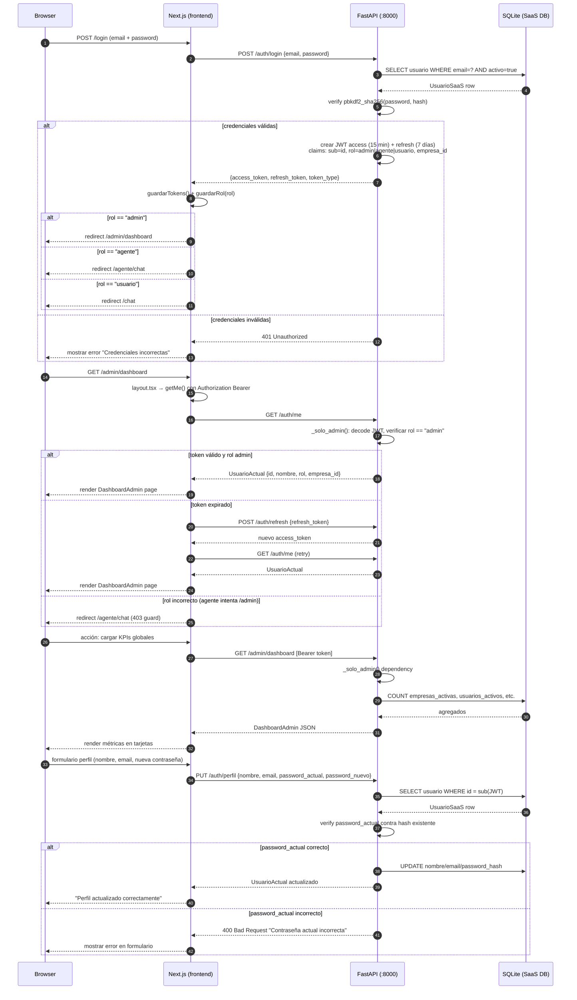

# UML ANDRÓMEDA — Arquitectura del Sistema

> **Fecha:** Abril 2026  
> **Versión:** 10.0  
> **Propósito:** Documentar la arquitectura completa del sistema para referencia y onboarding.  
> **Visualización:** VS Code (extensión Mermaid), GitHub, Notion, draw.io  
> **Última actualización:** v10.0 — Post-lanzamiento: arquitectura SaaS multi-rol (admin/agente/usuario), 14 nuevas rutas API, schemas SaaS, frontend Next.js 14 con 11 vistas por rol  

---

## 📑 Índice

1. [Diagrama de Clases](#1--diagrama-de-clases)
2. [Diagrama de Secuencia — Consulta General](#2--diagrama-de-secuencia--flujo-consulta--excel)
3. [Diagrama de Secuencia — Cadena Multi-Agente](#3--diagrama-de-secuencia--cadena-multi-agente)
4. [Diagrama de Secuencia — Auditoría Calidad](#4--diagrama-de-secuencia--auditoría-de-calidad-de-datos)
5. [Diagrama de Componentes](#5--diagrama-de-componentes)
6. [Resumen de Capas](#6--resumen-de-capas)
7. [Patrones Arquitectónicos](#7--patrones-arquitectónicos)
8. [Diagrama de Clases — Capa SaaS v10.0](#8--diagrama-de-clases--capa-saas-v100)
9. [Diagrama de Secuencia — Autenticación SaaS Multi-Rol](#9--diagrama-de-secuencia--autenticación-saas-multi-rol)

---

## 1. 📐 Diagrama de Clases

> Muestra TODAS las clases del proyecto, sus atributos, métodos y cómo se relacionan.
> - **Línea sólida con diamante** (`*--`) = Composición (la clase contiene a la otra)
> - **Línea sólida con rombo vacío** (`o--`) = Agregación (la clase usa a la otra, pero no la "posee")
> - **Flecha punteada** (`-->`) = Dependencia / retorna
> - **Triángulo** (`--|>`) = Herencia

```mermaid
classDiagram
    direction TB

    %% ═══════════════════════════════════════════
    %% CAPA DE ENTRADA Y CONFIGURACIÓN
    %% ═══════════════════════════════════════════

    class Config {
        +str BASE_DIR
        +str DATA_DIR
        +str REPORTS_DIR
        +str VERSION
        +int GRADIO_SERVER_PORT
        +crear_directorios()
    }

    class ConfiguracionOdoo {
        +str url
        +str db
        +str usuario
        +str password
        +desde_json(ruta) ConfiguracionOdoo
        +default() ConfiguracionOdoo
    }

    %% ═══════════════════════════════════════════
    %% CAPA DE PRESENTACIÓN
    %% ═══════════════════════════════════════════

    class OdooAIProV5 {
        +OdooBotPro bot
        +ConectorOdoo odoo
        +MotorNLPAvanzado nlp_avanzado
        +CerebroAndromeda cerebro
        +MotorBIExperto motor_bi
        +AuditoriaInteligente auditoria
        +AuditoriaCalidadDatos auditoria_calidad
        +Analizador360 analizador_360
        +GestorMultiAgente multi_agente
        +MotorKPIsEmpresariales motor_kpis
        +KPIsFinancieros kpis_financieros
        +AnalizadorAnomalias analizador_anomalias
        +SistemaPrediccionInteligente prediccion
        +GeneradorReportes reportes
        +GeneradorGraficas graficas
        +AnalizadorAvanzado analizador
        +ConsultasEspecializadas consultas_esp
        +FormateadorRespuestas fmt
        +EjecutoresAgente _ejecutores
        +Dict _MAPA_ADVERTENCIAS$
        +int MAX_INPUT_LENGTH$
        +int MAX_REQUESTS_PER_MINUTE$
        +crear_interfaz() gr.Blocks
        -_procesar_mensaje(texto, historial)
        -_procesar_tradicional(mensaje, consulta)
        -_ejecutar_desde_gestor_agentes(consulta, mensaje, agente)
        -_ejecutar_accion(accion)
        -_ejecutar_consulta_avanzada_v2(accion, consulta)
        -_mapear_accion_a_consulta_odoo(accion) Dict
        -_validar_y_regenerar_respuesta(respuesta, consulta, df) str
        -_es_solicitud_mutacion_bd(texto) bool
        -_traducir_advertencias(advertencias) list
    }

    class GeneradorReportes {
        +str directorio
        +Dict colores
        +crear_excel_profesional(datos, titulo) str
        +crear_pdf_profesional(datos, titulo) str
        +crear_html_profesional() str
    }

    %% ═════════════════════════════════════════════
    %% CLASES EXTRAÍDAS (Refactoring ARQ-001 / ARQ-002)
    %% ═════════════════════════════════════════════

    class FormateadorRespuestas {
        +str MONEDA$
        +configurar_moneda(simbolo)$ void
        +_m : property
        +_formatear_ventas(datos) str
        +_formatear_inventario(datos) str
        +_formatear_finanzas(datos) str
        +_formatear_crm(datos) str
        +_formatear_compras(datos) str
        +_formatear_pdv(datos) str
        +_formatear_rrhh(datos) str
        +_formatear_predicciones(datos) str
        +_formatear_diagnostico(datos) str
        +_formatear_estadistica(datos) str
        +_formatear_matematicas(datos) str
        .. 41 métodos de formateo total ..
    }

    class EjecutoresAgente {
        -OdooAIProV5 bot
        +analizador AnalizadorAvanzado
        +predictor SistemaPrediccionInteligente
        +consultas_esp ConsultasEspecializadas
        +odoo ConectorOdoo
        +fmt FormateadorRespuestas
        +_ejecutor_ventas(consulta, mensaje) Tuple
        +_ejecutor_inventario(consulta, mensaje) Tuple
        +_ejecutor_finanzas(consulta, mensaje) Tuple
        +_ejecutor_crm(consulta, mensaje) Tuple
        +_ejecutor_compras(consulta, mensaje) Tuple
        +_ejecutor_pdv(consulta, mensaje) Tuple
        +_ejecutor_rrhh(consulta, mensaje) Tuple
        +_ejecutor_predicciones(consulta, mensaje) Tuple
        +_ejecutor_diagnostico(consulta, mensaje) Tuple
        +_ejecutor_odoo(consulta, mensaje) Tuple
        +_ejecutor_estadistica(consulta, mensaje) Tuple
        +_ejecutor_matematicas(consulta, mensaje) Tuple
    }

    %% ═════════════════════════════════════════════
    %% LOGGING Y CONFIGURACIÓN
    %% ═════════════════════════════════════════════

    class LoggingConfig {
        +configurar_logging() None
        +get_logger(nombre) Logger
        +FiltroCredenciales
    }

    class LoggerAvanzado {
        +Path ruta_logs
        +Path db_path
        +registrar_evento(tipo, modulo, mensaje) None
        +errores_por_modulo(dias) Dict
        +resumen_general() Dict
    }

    %% ═══════════════════════════════════════════
    %% CAPA CORE
    %% ═══════════════════════════════════════════

    class RespuestaBot {
        +str mensaje
        +str tipo
        +DataFrame datos
        +str archivo
        +List~str~ sugerencias
        +float confianza
    }

    class ContextoConversacion {
        +str ultimo_modelo
        +str ultima_consulta
        +DataFrame ultimos_datos
        +Dict filtros_activos
        +List~Dict~ historial
    }

    class OdooBotPro {
        +str VERSION
        +str NOMBRE
        +bool conectado
        +MotorNLP nlp
        +ConectorOdoo odoo
        +GeneradorReportes reportes
        +ContextoConversacion contexto
        +Dict handlers
        +conectar() Tuple
        +procesar(texto) RespuestaBot
        -_handle_ventas()
        -_handle_inventario()
        -_handle_clientes()
        -_handle_facturacion()
    }

    class CerebroAndromeda {
        +MatrizDatosOdoo matriz
        +LimpiadorDatos limpiador
        +MotorEstadistico motor_stats
        +GeneradorPrompts generador_prompts
        +analizar(tipo, datos, config) ResultadoAnalisis
    }

    class MatrizDatosOdoo {
        +Dict MODELOS
        +Dict CAMPOS
        +Dict RELACIONES
    }

    class LimpiadorDatos {
        +limpiar_dataframe(df, tipo) DataFrame
        +validar_tipos(df) DataFrame
        +remover_duplicados(df) DataFrame
        +tratar_valores_nulos(df) DataFrame
    }

    class MotorEstadistico {
        +calcular_zscore(serie) Series
        +detectar_outliers_iqr(serie) List
        +calcular_tendencia_lineal(serie) Dict
        +calcular_media_movil(serie, ventana) Series
    }

    class ResultadoAnalisis {
        +bool exito
        +Any datos
        +DataFrame df
        +str resumen
        +str respuesta_md
        +float confianza
        +int registros_totales
        +List~str~ alertas
        +Dict metricas
    }

    class MotorBIExperto {
        +float ZSCORE_THRESHOLD
        +float UMBRAL_MARGEN_MINIMO
        +generar_reporte_bi() ReporteBI
        +detectar_anomalias() List
        +calcular_kpis() List
        +generar_alertas() List
    }

    %% ═══════════════════════════════════════════
    %% CAPA DE MODELOS / DATOS
    %% ═══════════════════════════════════════════

    class ConectorOdoo {
        +ConfiguracionOdoo config
        +ODOO odoo
        +bool conectado
        +Dict _cache_modelos
        +Dict modelos_principales
        +conectar() Tuple
        +desconectar()
        +contar(modelo, filtro) int
        +buscar(modelo, filtro, campos) DataFrame
        +buscar_leer(modelo, filtro, campos) List
        +search_read(modelo, dominio, campos, limite, orden) List
        +ventas_periodo(inicio, fin) DataFrame
        +stock_disponible() DataFrame
        +clientes_activos() DataFrame
        +facturas(inicio, fin) DataFrame
    }

    class ModeloOdoo {
        +str nombre_tecnico
        +str nombre_display
        +str descripcion
        +Dict campos
        +List keywords
    }

    class CampoOdoo {
        +str nombre
        +str tipo
        +str etiqueta
        +bool requerido
        +str relacion
    }

    %% ═══════════════════════════════════════════
    %% SERVICIOS ESPECIALIZADOS
    %% ═══════════════════════════════════════════

    class AuditoriaInteligente {
        +ConectorOdoo conector
        +auditoria_nocturna_completa() ResultadoAuditoria
        +prediccion_churn() List~PrediccionChurn~
        -_detectar_facturas_precio_cero()
        -_detectar_stock_negativo()
        -_detectar_pagos_duplicados()
        -_detectar_margenes_peligrosos()
    }

    class AuditoriaCalidadDatos {
        +ConectorOdoo odoo
        +Dict sla
        +List hallazgos
        +ejecutar_auditoria_completa() ResultadoCalidadDatos
        +formatear_resultado_markdown(res) str
        -_fase_estado_vs_vinculo() int
        -_fase_sla_zombis() int
        -_fase_datos_incompletos() int
        -_enriquecer_hallazgos()
        -_generar_excel(resultado) str
    }

    class HallazgoCalidad {
        +str categoria
        +str severidad
        +str modelo_odoo
        +int registro_id
        +str descripcion
        +str empresa
        +str unidad_operativa
        +str usuario_creador
        +to_dict() Dict
    }

    class ResultadoCalidadDatos {
        +datetime fecha_ejecucion
        +int total_registros_analizados
        +List hallazgos
        +Dict resumen_por_empresa
        +Dict resumen_por_unidad_operativa
        +List top_usuarios_problemas
        +float porcentaje_datos_confiables
        +float porcentaje_datos_basura
        +str nivel_salud
    }

    class AnalizadorAnomalias {
        +ConectorOdoo conector
        +ejecutar_auditoria_completa() ResultadoAuditoria
        -_analizar_transacciones_sospechosas()
        -_analizar_notas_credito()
        -_analizar_descuentos_excesivos()
        -_analizar_ajustes_inventario()
    }

    class Analizador360 {
        +ConectorOdoo conector
        +DetectorEntidades detector
        +analizar(mensaje) Analisis360
    }

    class DetectorEntidades {
        +ConectorOdoo conector
        +detectar(mensaje) EntidadDetectada
        -_cargar_cache()
        -_buscar_entidad_directa(nombre)
    }

    class MotorKPIsEmpresariales {
        +ConectorOdoo conector
        +Dict kpis_disponibles
        +kpi_ventas_mensuales() ResultadoKPI
        +kpi_ventas_por_canal() ResultadoKPI
        +kpi_rotacion_personal() ResultadoKPI
    }

    class KPIsFinancieros {
        +ConectorOdoo conector
        +Dict OBJETIVOS
        +generar_dashboard_ejecutivo() DashboardEjecutivo
        -_calcular_kpis_ventas()
        -_calcular_kpis_rentabilidad()
        -_calcular_kpis_liquidez()
    }

    class GestorMultiAgente {
        +Dict~str AgenteEspecializadoBase~ agentes
        +Dict~str Callable~ _ejecutores
        +Callable ejecutor_default
        +resolver_agente(accion, mensaje) Tuple
        +pre_ejecutar(agente, consulta) ResultadoPreEjecucion
        +post_ejecutar(agente, respuesta, df) ResultadoPostEjecucion
        +planificar_cadena(mensaje, accion) List~PasoAgente~
        +es_cadena(mensaje, accion) bool
        +obtener_prompts_cadena(pasos) str
        +pre_ejecutar_cadena(pasos, consulta, mensaje) List~PasoAgente~
        +ejecutar_cadena_completa(pasos, consulta, respuesta, df) ResultadoCadena
        +post_ejecutar_cadena(pasos, consulta, respuesta, df) ResultadoCadena
        +registrar_ejecutor(agente_id, fn)
        +registrar_ejecutor_default(fn)
        +resumen_cadena(resultado) str
    }

    class AgenteEspecializadoBase {
        +str id_agente
        +str prompt_base
        +Set acciones_soportadas
        +Set palabras_clave_prompt
        +score_prompt(mensaje) float
        +soporta_accion(accion) bool
        +pre_ejecucion(consulta, mensaje) ResultadoPreEjecucion
        +post_ejecucion(consulta, respuesta, df) ResultadoPostEjecucion
        +enriquecer_respuesta(consulta, respuesta, df) str
        +ejecutar(consulta, mensaje) Tuple
    }

    class ResultadoPreEjecucion {
        +bool permitido
        +Any consulta
        +List~str~ advertencias
        +str motivo_bloqueo
        +bool requiere_confirmacion
        +float confianza_agente
    }

    class ResultadoPostEjecucion {
        +str respuesta
        +float confianza_datos
        +List~str~ observaciones
    }

    class PasoAgente {
        +str agente_id
        +str rol
        +ResultadoPreEjecucion resultado_pre
        +ResultadoPostEjecucion resultado_post
        +str respuesta_parcial
        +Any datos_parciales
        +float confianza
        +bool exito
        +str error
    }

    class ResultadoCadena {
        +str respuesta_final
        +float confianza_consolidada
        +List~str~ agentes_involucrados
        +List~PasoAgente~ pasos
        +List~str~ advertencias
        +List~str~ observaciones
        +str prompt_combinado
        +Any datos_consolidados
    }

    class AgentVentas
    class AgentInventarios
    class AgentFinanzas
    class AgentDiagnostico
    class AgentConsultasOdoo
    class AgentCRM
    class AgentCompras
    class AgentPDV
    class AgentPredicciones
    class AgentMatematicas
    class AgentEstadistica
    class AgentRRHH
    class AgentValidadorFinal

    %% ═══════════════════════════════════════════
    %% NLP / LLM / PREDICCIÓN / MEMORIA
    %% ═══════════════════════════════════════════

    class MotorNLPAvanzado {
        +CerebroNLP cerebro
        +MotorEmbeddings embeddings
        +NormalizadorPrompt normalizador
        +Dict intenciones_mapa
        +entender_consulta(mensaje) ConsultaEntendida
        +detectar_intencion(texto) Dict
        +extraer_entidades(texto) Dict
        +detectar_periodo(texto) Dict
        -_inicializar_patrones()
        -_inicializar_sinonimos()
        -_inicializar_intenciones()
    }

    class MotorNLP {
        +bool usar_spacy
        +bool usar_embeddings
        +detectar_intencion(texto) IntencionDetectada
        +extraer_entidades(texto) List~EntidadExtraida~
        -_definir_intenciones()
        -_definir_patrones_entidades()
        -_definir_sinonimos()
    }

    class CerebroNLP {
        +Dict conocimiento_dominio
        +Dict patrones_semanticos
        +Dict grafos_intenciones
        -_init_conocimiento()
        -_init_patrones_semanticos()
        -_init_grafos_intenciones()
    }

    class MotorEmbeddings {
        +SentenceTransformer modelo
        +ndarray embeddings_intenciones
        +Dict intenciones_map
        +float umbral_confianza
        +detectar_intencion(texto) Tuple~str float~
        -_inicializar()
        -_cargar_cache() bool
        -_generar_embeddings()
        -_construir_corpus() Tuple
    }

    class MotorEmpatico {
        +detectar_emocion(mensaje) str
        +detectar_tema_casual(mensaje) str
        +generar_respuesta(contexto) str
    }

    class AgenteAndromeda {
        +ConectorOllama ollama
        +str modelo_activo
        +generar_respuesta(prompt, contexto) str
        +analizar_con_ia(datos, pregunta) str
        -_seleccionar_mejor_modelo() str
        -_get_system_prompt() str
        -_extraer_accion(respuesta) AccionDetectada
    }

    class ConectorOllama {
        +str modelo
        +str base_url
        +consultar(prompt) str
        +disponible() bool
        +obtener_modelos() List~str~
    }

    class GeneradorQueries {
        +Set CAMPOS_PROHIBIDOS$
        +Set MODELOS_PROHIBIDOS$
        +generar_query(consulta) QueryOdoo
        -_filtrar_campos_seguros(campos) List~str~
    }

    class SistemaPrediccionInteligente {
        +predecir_ventas_inteligente(dias) PrediccionInteligente
        +predecir_agotamiento_inteligente() List~RecomendacionReposicion~
        +calcular_score_morosos() List~ScoreClienteMoroso~
    }

    class MotorML {
        +predecir_ventas_ml(dias) PrediccionML
        +segmentar_clientes(n_clusters) SegmentacionML
        +detectar_anomalias_ml(df, columna) Dict
    }

    class MotorNeuralLSTM {
        +ConfigLSTM config
        +predecir_ventas_lstm(dias) PrediccionLSTM
        +entrenar_modelo() None
        -_preparar_datos() ndarray
        -_normalizar_datos() ndarray
    }

    %% ═══════════════════════════════════════════
    %% MEMORIA VECTORIAL, JERÁRQUICA Y GRAFO
    %% ═══════════════════════════════════════════

    class MemoriaVectorial {
        +PersistentClient cliente
        +Dict colecciones
        +SentenceTransformer modelo_embeddings
        +EmbeddingFunction _embedding_function
        +int MAX_DOCUMENTOS_POR_COLECCION$
        +Dict COLECCIONES$
        +guardar_conversacion(...) bool
        +guardar_analisis(...) bool
        +guardar_alerta(...) bool
        +buscar(consulta, tipo, limite) ResultadoBusqueda
        +limpiar_antiguos(dias) int
        -_inicializar_db()
        -_inicializar_embeddings()
        -_aplicar_embedding_function()
        -_generar_embedding(texto) List~float~
        -_controlar_crecimiento(coleccion)
        -_purgar_coleccion(coleccion, dias) int
    }

    class MemoriaJerarquica {
        +MemoriaVectorial vectorial
        +GrafoConocimiento grafo
        +MemoriaSesion sesion
        +MemoriaContextual contexto
        +MemoriaPreferenciasUsuario preferencias
        +registrar_interaccion(...) None
        +actualizar_contexto(accion, intencion, parametros, modelo_erp)
        +aplicar_contexto_a_consulta(consulta) str
        +obtener_contexto_grafo(accion, entidades) str
        +buscar_semantico(consulta, limite) List~str~
        +limpiar_todo(dias_antiguedad) Dict
        +snapshot() Dict
        -_cargar_preferencias()
        -_guardar_preferencias()
    }

    class GrafoConocimiento {
        +DiGraph grafo
        +ExtractorEntidades extractor
        +int MAX_NODOS$
        +int MAX_ARISTAS$
        +int DECAY_DIAS$
        +int _contador_interacciones
        +registrar_interaccion(mensaje, respuesta, accion, ...) None
        +obtener_contexto_relacional(accion, entidades, ...) str
        +agregar_nodo(tipo, nombre) str
        +agregar_relacion(origen, destino, tipo) None
        +entidades_frecuentes() List
        +relaciones_de(nombre) List
        +camino_entre(a, b) List
        +estadisticas() Dict
        +guardar() None
        -_cargar()
        -_podar_si_necesario()
    }

    class ExtractorEntidades {
        +extraer_de_mensaje(mensaje) List~Tuple~
        +extraer_de_dataframe(df, modelo_erp) List~Tuple~
        +extraer_de_parametros(parametros, accion) List~Tuple~
    }

    class TipoNodo {
        <<enumeration>>
        CLIENTE
        PRODUCTO
        PROVEEDOR
        EMPLEADO
        FACTURA
        ORDEN
        ACCION
        INTENCION
        PERIODO
        MONTO
        CATEGORIA
        TIENDA
        ALMACEN
        ANALISIS
    }

    class TipoRelacion {
        <<enumeration>>
        CONSULTO
        INVOLUCRA
        PERIODO_DE
        COMPRA
        PROVEE
        VENDE
        RELACIONADO
        CONTIENE
        RESULTADO
    }

    %% ═══════════════════════════════════════════
    %% UTILIDADES
    %% ═══════════════════════════════════════════

    class ValidadorDatos {
        +validar_df_completo(df) MetricasCalidad
        +validar_campo_requerido(valor) ResultadoValidacion
        +generar_reporte_calidad() MetricasCalidad
    }

    class ConsultasEspecializadas {
        +ConectorOdoo conector
        +ventas_completo() Dict
        +ventas_vs_periodo_anterior() Dict
    }

    class MonitorSistema {
        +resumen_general() Dict
        +errores_por_modulo(dias) Dict
    }

    %% ═══════════════════════════════════════════
    %% RELACIONES
    %% ═══════════════════════════════════════════

    OdooAIProV5 *-- OdooBotPro : orquesta
    OdooAIProV5 *-- ConectorOdoo : conexión datos
    OdooAIProV5 *-- MotorNLPAvanzado : procesa lenguaje
    OdooAIProV5 *-- CerebroAndromeda : análisis avanzado
    OdooAIProV5 *-- MotorBIExperto : business intelligence
    OdooAIProV5 *-- AuditoriaInteligente : auditoría nocturna
    OdooAIProV5 *-- AuditoriaCalidadDatos : calidad datos
    OdooAIProV5 *-- Analizador360 : análisis 360
    OdooAIProV5 *-- AnalizadorAnomalias : anomalías
    OdooAIProV5 *-- GestorMultiAgente : agentes
    OdooAIProV5 *-- MotorKPIsEmpresariales : KPIs
    OdooAIProV5 *-- KPIsFinancieros : finanzas
    OdooAIProV5 *-- SistemaPrediccionInteligente : predicción
    OdooAIProV5 *-- GeneradorReportes : reportes
    OdooAIProV5 *-- AgenteAndromeda : LLM
    OdooAIProV5 *-- FormateadorRespuestas : formateo
    OdooAIProV5 *-- EjecutoresAgente : ejecutores

    EjecutoresAgente o-- OdooAIProV5 : delega a bot
    EjecutoresAgente o-- FormateadorRespuestas : usa
    EjecutoresAgente o-- ConsultasEspecializadas : usa
    EjecutoresAgente o-- ConectorOdoo : usa

    Config o-- LoggingConfig : configura logging
    LoggerAvanzado o-- LoggingConfig : extiende

    OdooBotPro *-- ContextoConversacion
    OdooBotPro o-- ConectorOdoo
    OdooBotPro o-- GeneradorReportes
    OdooBotPro --> RespuestaBot : retorna

    CerebroAndromeda *-- MatrizDatosOdoo
    CerebroAndromeda *-- LimpiadorDatos
    CerebroAndromeda *-- MotorEstadistico
    CerebroAndromeda --> ResultadoAnalisis : retorna

    AuditoriaCalidadDatos o-- ConectorOdoo
    AuditoriaCalidadDatos --> HallazgoCalidad : genera
    AuditoriaCalidadDatos --> ResultadoCalidadDatos : retorna

    AuditoriaInteligente o-- ConectorOdoo
    AnalizadorAnomalias o-- ConectorOdoo
    Analizador360 o-- ConectorOdoo
    Analizador360 *-- DetectorEntidades
    DetectorEntidades o-- ConectorOdoo
    MotorKPIsEmpresariales o-- ConectorOdoo
    KPIsFinancieros o-- ConectorOdoo
    ConsultasEspecializadas o-- ConectorOdoo

    GestorMultiAgente *-- AgenteEspecializadoBase
    GestorMultiAgente --> PasoAgente : planifica
    GestorMultiAgente --> ResultadoCadena : consolida
    ResultadoCadena *-- PasoAgente
    PasoAgente o-- ResultadoPreEjecucion
    PasoAgente o-- ResultadoPostEjecucion
    AgentVentas --|> AgenteEspecializadoBase
    AgentInventarios --|> AgenteEspecializadoBase
    AgentFinanzas --|> AgenteEspecializadoBase
    AgentDiagnostico --|> AgenteEspecializadoBase
    AgentConsultasOdoo --|> AgenteEspecializadoBase
    AgentCRM --|> AgenteEspecializadoBase
    AgentCompras --|> AgenteEspecializadoBase
    AgentPDV --|> AgenteEspecializadoBase
    AgentPredicciones --|> AgenteEspecializadoBase
    AgentMatematicas --|> AgenteEspecializadoBase
    AgentEstadistica --|> AgenteEspecializadoBase
    AgentRRHH --|> AgenteEspecializadoBase
    AgentValidadorFinal --|> AgenteEspecializadoBase

    AgenteAndromeda *-- ConectorOllama
    AgenteAndromeda o-- GeneradorQueries

    %% Relaciones NLP
    MotorNLPAvanzado *-- CerebroNLP
    MotorNLPAvanzado *-- MotorEmbeddings
    MotorNLPAvanzado o-- MotorNLP
    MotorNLPAvanzado o-- MotorEmpatico

    %% Relaciones Memoria
    MemoriaJerarquica *-- MemoriaVectorial
    MemoriaJerarquica *-- GrafoConocimiento
    GrafoConocimiento *-- ExtractorEntidades
    GrafoConocimiento o-- TipoNodo
    GrafoConocimiento o-- TipoRelacion
    OdooAIProV5 *-- MemoriaJerarquica : memoria
    MemoriaVectorial --> CHROMA : persiste en

    %% Relaciones Predicción / ML
    SistemaPrediccionInteligente o-- ConectorOdoo
    MotorML o-- ConectorOdoo
    MotorNeuralLSTM o-- ConectorOdoo

    ConectorOdoo o-- ConfiguracionOdoo
    ModeloOdoo *-- CampoOdoo
```

---

## 2. 🔄 Diagrama de Secuencia — Flujo Consulta → Excel

> Documenta el camino completo de 24 pasos: desde que el usuario escribe "Dame las ventas del mes"
> hasta que recibe la respuesta validada con tabla interactiva y Excel descargable.

```mermaid
sequenceDiagram
    autonumber
    actor Usuario
    participant UI as InterfazAndromeda<br/>(Gradio)
    participant NORM as NormalizadorPrompt
    participant NLP as CerebroNLP
    participant GMA as GestorMultiAgente<br/>(Orquestador)
    participant AGT as AgentVentas<br/>(Especializado)
    participant EXEC as _ejecutor_ventas<br/>(Executor Dedicado)
    participant Odoo as ConectorOdoo
    participant DB as Odoo ERP<br/>(database)
    participant ENR as enriquecer_respuesta
    participant VF as AgentValidadorFinal
    participant REGEN as _validar_y_regenerar
    participant Rep as GeneradorReportes

    rect rgb(40, 60, 90)
        Note over Usuario, UI: 1. ENTRADA DEL USUARIO
        Usuario->>+UI: "Dame las ventas del mes"
        UI->>UI: procesar_mensaje(texto, historial)
    end

    rect rgb(50, 60, 50)
        Note over UI, NORM: 2-3. NORMALIZACIÓN + EMPATÍA
        UI->>+NORM: normalizar(mensaje)
        NORM->>NORM: Corregir typos, abreviaciones
        NORM-->>-UI: mensaje limpio
        UI->>UI: Verificar saludo/despedida (fast-path)
    end

    rect rgb(50, 70, 50)
        Note over UI, GMA: 4-6. NLP + SELECCIÓN DE AGENTE
        UI->>+NLP: entender(mensaje)
        NLP->>NLP: Detectar intención (90+ triggers)
        NLP->>NLP: Extraer entidades (fechas, filtros, modelos)
        NLP-->>-UI: ConsultaEntendida(accion, confianza, params)
        UI->>UI: (Opcional) Ollama enriquece intención
        UI->>+GMA: resolver_agente("consultar_ventas", texto)
        GMA->>GMA: 1° Acción → agente_ventas (0.95)
        GMA-->>-UI: (agente_id="agente_ventas", confianza=0.95)
    end

    rect rgb(60, 60, 50)
        Note over UI, AGT: 7-8. PRE-VALIDACIÓN + CONFIANZA
        UI->>+GMA: pre_ejecutar("agente_ventas", consulta)
        GMA->>+AGT: pre_ejecucion(consulta, mensaje)
        AGT->>AGT: Si no hay fechas → default 30 días
        AGT->>AGT: Validar campos requeridos
        AGT-->>-GMA: ResultadoPre(ok, consulta+fechas, conf=0.92)
        GMA-->>-UI: consulta enriquecida
        UI->>UI: confianza = NLP(0.9)×0.8 + Agente(0.92)×0.2 = 0.90
    end

    rect rgb(70, 50, 50)
        Note over UI, DB: 9-10. EJECUCIÓN CON EXECUTOR DEDICADO
        UI->>+GMA: ejecutar_accion("agente_ventas", consulta, msg)
        GMA->>GMA: Buscar ejecutor registrado → _ejecutor_ventas
        GMA->>+EXEC: _ejecutor_ventas(consulta, mensaje)
        EXEC->>EXEC: Mapear acción → backend rico
        EXEC->>+Odoo: consultas_esp.ventas_completo()
        Odoo->>+DB: search_read(sale.order, filtros, campos)
        DB-->>-Odoo: registros crudos
        Odoo-->>-EXEC: DataFrame con datos
        EXEC-->>-GMA: (respuesta_md, DataFrame)
        GMA-->>-UI: (respuesta, df)
    end

    rect rgb(50, 50, 70)
        Note over UI, VF: 11-13. ENRIQUECIMIENTO + VALIDACIÓN TRIPLE
        UI->>+GMA: post_ejecutar("agente_ventas", consulta, resp, df)
        GMA->>+ENR: AgentVentas.enriquecer_respuesta(consulta, resp, df)
        ENR->>ENR: Pareto top 20% clientes
        ENR->>ENR: Concentración de ventas
        ENR-->>-GMA: respuesta + análisis determinístico
        GMA->>+AGT: post_ejecucion(consulta, respuesta, df)
        AGT->>AGT: ¿Hay evidencia tabular? → Sí → conf alta
        AGT-->>-GMA: ResultadoPost(resp, conf=0.88)
        GMA->>+VF: post_ejecucion(consulta, respuesta, df)
        VF->>VF: ¿Respuesta corresponde a lo pedido? → Sí
        VF-->>-GMA: ResultadoPost(resp, conf=0.90)
        GMA-->>-UI: respuesta validada, confianza = 0.90
    end

    rect rgb(60, 40, 60)
        Note over UI, REGEN: 14-15. LOOP DE REGENERACIÓN (si necesario)
        UI->>+REGEN: _validar_y_regenerar_respuesta(resp, consulta, df)
        REGEN->>REGEN: ¿Respuesta < 24 chars? ¿Claims sin datos?
        REGEN->>REGEN: Confianza 0.90 >= 0.78 → OK, no regenerar
        REGEN-->>-UI: respuesta final aprobada
    end

    rect rgb(50, 60, 60)
        Note over UI, Rep: 16-17. REPORTE + MEMORIA
        UI->>+Rep: crear_excel_profesional(df, titulo)
        Rep-->>-UI: ruta_archivo.xlsx
        UI->>UI: Registrar en memoria jerárquica
        UI->>UI: Registrar en logging
    end

    rect rgb(40, 60, 90)
        Note over UI, Usuario: 18. RESPUESTA AL USUARIO
        UI->>UI: ✓ consultar_ventas [agente_ventas] (90%)
        UI-->>-Usuario: Respuesta + Tabla HTML + Excel descargable
    end
```



---

## 3. 🔗 Diagrama de Secuencia — Cadena Multi-Agente

> Documenta cómo un prompt complejo activa múltiples agentes que EJECUTAN en cadena colaborativa.
> Ejemplo: "ventas por marca y cuál es su tendencia" → Ventas ejecuta → Estadística ejecuta → Predicciones ejecuta

```mermaid
sequenceDiagram
    autonumber
    actor Usuario
    participant UI as InterfazAndromeda<br/>(Gradio)
    participant NLP as CerebroNLP
    participant GMA as GestorMultiAgente<br/>(Orquestador)
    participant AV as AgentVentas<br/>(Principal)
    participant EXV as _ejecutor_ventas
    participant AE as AgentEstadistica<br/>(Enriquecimiento)
    participant EXE as _ejecutor_estadistica
    participant AP as AgentPredicciones<br/>(Cálculo)
    participant EXP as _ejecutor_predicciones
    participant VF as AgentValidadorFinal
    participant Odoo as ConectorOdoo
    participant DB as Odoo ERP

    rect rgb(40, 60, 90)
        Note over Usuario, UI: 1. ENTRADA DEL USUARIO
        Usuario->>+UI: "¿Cómo van las ventas por marca y cuál es su tendencia?"
        UI->>UI: procesar_mensaje(texto, historial)
    end

    rect rgb(50, 70, 50)
        Note over UI, GMA: 2. NLP + PLANIFICACIÓN DE CADENA
        UI->>+NLP: entender(texto)
        NLP-->>-UI: {accion: "analisis_ventas", entidades: {marca, tendencia}}
        UI->>+GMA: resolver_agente() → agente_ventas (principal)
        GMA-->>-UI: agente_ventas
        UI->>+GMA: es_cadena(mensaje, "analisis_ventas", "agente_ventas")
        GMA->>GMA: Escanear REGLAS_CADENA: "tendencia" → estadistica + predicciones
        GMA-->>-UI: True
        UI->>+GMA: planificar_cadena(mensaje, accion, agente)
        GMA-->>-UI: [PasoAgente(ventas,principal), PasoAgente(estadistica,enriquecimiento), PasoAgente(predicciones,calculo)]
        Note over UI: es_cadena = True (3 agentes)
    end

    rect rgb(60, 50, 70)
        Note over UI, AP: 3. PRE-EJECUCIÓN EN CADENA (enriquecer consulta)
        UI->>+GMA: pre_ejecutar_cadena(pasos, consulta, mensaje)
        GMA->>+AV: pre_ejecucion(consulta, mensaje)
        AV->>AV: Si no hay fechas → default 30 días
        AV-->>-GMA: ResultadoPre(ok, consulta+fechas, conf=0.92)
        GMA->>+AE: pre_ejecucion(consulta, mensaje)
        AE->>AE: Si no hay rango → default 90 días para estadística
        AE-->>-GMA: ResultadoPre(ok, consulta+rango, conf=0.90)
        GMA->>+AP: pre_ejecucion(consulta, mensaje)
        AP->>AP: Requiere histórico 180 días para predicción
        AP-->>-GMA: ResultadoPre(ok, consulta+historico, conf=0.85)
        GMA-->>-UI: pasos enriquecidos
    end

    rect rgb(70, 50, 50)
        Note over UI, DB: 4. EJECUCIÓN AGENTE PRINCIPAL (executor dedicado)
        UI->>+GMA: ejecutar_accion("agente_ventas", consulta, msg)
        GMA->>+EXV: _ejecutor_ventas(consulta, mensaje)
        EXV->>+Odoo: consultas_esp.ventas_completo()
        Odoo->>+DB: search_read(sale.order, filtros)
        DB-->>-Odoo: registros ventas por marca
        Odoo-->>-EXV: DataFrame
        EXV-->>-GMA: (respuesta_principal, df_principal)
        GMA-->>-UI: (respuesta, df)
    end

    rect rgb(50, 60, 60)
        Note over UI, EXP: 5. EJECUCIÓN CADENA COMPLETA (cada agente EJECUTA su paso)
        UI->>+GMA: ejecutar_cadena_completa(pasos, consulta, resp_principal, df)
        
        Note over GMA, EXE: Paso 1: Estadística EJECUTA su propio análisis
        GMA->>+EXE: _ejecutor_estadistica(consulta, mensaje)
        EXE->>EXE: Analizar tendencia + Pareto avanzado
        EXE-->>-GMA: (resp_estadistica, df_stat)
        GMA->>+AE: enriquecer_respuesta(consulta, resp_acumulada, df)
        AE->>AE: Añadir métricas estadísticas determinísticas
        AE-->>-GMA: respuesta enriquecida
        GMA->>+AE: post_ejecucion(consulta, resp, df)
        AE->>AE: Muestra >= 30 → conf alta
        AE-->>-GMA: ResultadoPost(conf=0.90)

        Note over GMA, EXP: Paso 2: Predicciones EJECUTA su propio forecast
        GMA->>+EXP: _ejecutor_predicciones(consulta, mensaje)
        EXP->>EXP: Forecast estacional + Monte Carlo
        EXP-->>-GMA: (resp_forecast, df_pred)
        GMA->>+AP: enriquecer_respuesta(consulta, resp_acumulada, df)
        AP->>AP: Añadir disclaimer + intervalos de confianza
        AP-->>-GMA: respuesta enriquecida
        GMA->>+AP: post_ejecucion(consulta, resp, df)
        AP->>AP: Agregar disclaimer predicción
        AP-->>-GMA: ResultadoPost(conf=0.85)
    end

    rect rgb(60, 50, 60)
        Note over GMA, VF: 6. VALIDACIÓN FINAL DE CADENA
        GMA->>+VF: post_ejecucion(consulta, resp_consolidada, df)
        VF->>VF: Respuesta aborda ventas + tendencia + forecast → Sí
        VF-->>-GMA: ResultadoPost(conf=0.88)
        GMA->>GMA: Confianza = (principal×2.0 + estadistica×1.0 + predicciones×1.0 + validador×1.5) / 5.5
        GMA-->>-UI: ResultadoCadena(resp_final, conf=0.89)
    end

    rect rgb(40, 60, 90)
        Note over UI, Usuario: 7. RESPUESTA CONSOLIDADA
        UI->>UI: _validar_y_regenerar_respuesta() — conf 0.89 > 0.78 → OK
        UI->>UI: resumen_cadena(resultado)
        UI-->>-Usuario: Respuesta con datos + tendencia + forecast + confianza 89%<br/>🔗 Cadena: Ventas(✅92%) → Estadística(✅90%) → Predicciones(✅85%)
    end
```



---

## 4. �🔍 Diagrama de Secuencia — Auditoría de Calidad de Datos

> Documenta la triple validación: Huérfanos → Zombis → Incompletos → Enriquecimiento → Excel

```mermaid
sequenceDiagram
    autonumber
    actor Usuario
    participant UI as OdooAIProV5
    participant NLP as MotorNLPAvanzado
    participant ACD as AuditoriaCalidadDatos
    participant Odoo as ConectorOdoo
    participant DB as Odoo ERP
    participant XL as Excel (openpyxl)

    Usuario->>+UI: "Auditoría de calidad de datos"
    UI->>+NLP: detectar_intencion(texto)
    NLP-->>-UI: {intencion: "auditoria_calidad_datos"}
    UI->>+ACD: ejecutar_auditoria_completa()

    rect rgb(70, 40, 40)
        Note over ACD, DB: FASE 1 — Estado vs Vínculo (Huérfanos)
        ACD->>+Odoo: search_count(account.move, no canceladas)
        Odoo->>+DB: count()
        DB-->>-Odoo: 2,000 total
        Odoo-->>-ACD: total_universo = 2000
        ACD->>+Odoo: search_read(pago vinculado + residual > 0)
        Odoo->>+DB: search_read filtrado
        DB-->>-Odoo: 50 facturas problemáticas
        Odoo-->>-ACD: hallazgos fase 1
        Note over ACD: Repite 5 validaciones:<br/>facturas_pago_huerfano | ventas_sin_factura<br/>pickings_sin_origen | pagos_sin_factura<br/>compras_sin_recepcion
    end

    rect rgb(40, 40, 70)
        Note over ACD, DB: FASE 2 — SLA / Zombis
        ACD->>+Odoo: search_count(facturas draft)
        Odoo-->>-ACD: total_universo
        ACD->>+Odoo: search_read(draft + create_date < SLA)
        Odoo-->>-ACD: facturas zombi
        Note over ACD: Repite 5 validaciones:<br/>zombis_facturas | zombis_cotizaciones<br/>zombis_compras_draft | zombis_pickings<br/>zombis_crm
    end

    rect rgb(40, 70, 40)
        Note over ACD, DB: FASE 3 — Datos Incompletos
        ACD->>+Odoo: search_count(clientes activos)
        Odoo-->>-ACD: total_universo
        ACD->>+Odoo: search_read(sin email, sin tel, sin cel)
        Odoo-->>-ACD: clientes incompletos
        Note over ACD: Repite 5 validaciones:<br/>clientes_sin_contacto | productos_sin_precio<br/>facturas_total_cero | lineas_sin_producto<br/>stock_cantidad_cero
    end

    rect rgb(70, 60, 30)
        Note over ACD, DB: ENRIQUECIMIENTO — Empresa / UO / Usuario
        ACD->>ACD: Agrupar hallazgos por modelo_odoo
        loop Por cada modelo (account.move, sale.order, ...)
            ACD->>+Odoo: read(ids, [company_id, create_uid, operating_unit_id])
            Odoo->>+DB: read batch
            DB-->>-Odoo: datos trazabilidad
            Odoo-->>-ACD: {empresa, usuario, unidad_operativa}
        end
        ACD->>ACD: Asignar empresa/usuario/UO a cada hallazgo
    end

    rect rgb(50, 50, 50)
        Note over ACD, XL: CÁLCULO + EXCEL
        ACD->>ACD: pct_basura = hallazgos / total_analizados × 100
        ACD->>ACD: Resumen por empresa, UO, top_usuarios
        ACD->>+XL: Crear Excel con 8 hojas
        Note over XL: Resumen | Hallazgos | Por Categoría<br/>Por Severidad | Por Modelo | Por Empresa<br/>Por Unidad Operativa | Top Usuarios
        XL->>XL: Estilos + colores severidad
        XL-->>-ACD: ruta_archivo.xlsx
    end

    ACD->>ACD: formatear_resultado_markdown()
    ACD-->>-UI: ResultadoCalidadDatos

    UI->>UI: Renderizar Markdown con tablas:<br/>🏢 Empresa | 🏭 UO | 👤 Top 3 Usuarios
    UI-->>-Usuario: Chat + Excel descargable
```



---

## 5. 📦 Diagrama de Componentes

> Muestra cómo se integra el núcleo de Python con todos los módulos,
> servicios externos y capas del sistema.

```mermaid
graph TB
    subgraph EXTERNAL["☁️ SISTEMAS EXTERNOS"]
        ODOO_ERP["🏢 Odoo ERP v17<br/>━━━━━━━━━━━━━━━━━<br/>sale.order · account.move<br/>stock.picking · res.partner<br/>pos.order · purchase.order<br/>crm.lead · product.template<br/>hr.employee · 40+ modelos"]
        OLLAMA["🤖 Ollama LLM<br/>(localhost:11434)<br/>━━━━━━━━━━━━━━━━━<br/>Llama 3.2 · Mistral<br/>DeepSeek-R1:8b"]
        CHROMA["🧠 ChromaDB<br/>(data/memoria/)<br/>━━━━━━━━━━━━━━━━━<br/>6 Colecciones<br/>EF: MiniLM-L12-v2 (384d)<br/>Max 10K docs/colección"]
        NX_GRAPH["🕸️ NetworkX Graph<br/>(data/memoria/grafo.json)<br/>━━━━━━━━━━━━━━━━━<br/>DiGraph · 14 tipos nodo<br/>9 tipos relación<br/>Decay 90 días"]
    end

    subgraph ENTRY["🚀 PUNTO DE ENTRADA"]
        MAIN["main.py<br/>━━━━━━━━━━━━━<br/>iniciar_web() -> None<br/>iniciar_consola() -> None"]
        CONFIG["app/config.py<br/>━━━━━━━━━━━━━<br/>Config<br/>ConfiguracionOdoo<br/>.env (python-dotenv)"]
        LOGCFG["app/logging_config.py<br/>━━━━━━━━━━━━━━━━━━━<br/>configurar_logging()<br/>get_logger()<br/>FiltroCredenciales<br/>RotatingFileHandler"]
    end

    subgraph VIEWS["🎨 CAPA DE PRESENTACIÓN"]
        UI["views/interfaz_v5.py<br/>━━━━━━━━━━━━━━━━━━━<br/>InterfazAndromeda<br/>Gradio Blocks :7860<br/>Chatbot · Sidebar · Botones<br/>107+ Mapeos Odoo<br/>Pipeline Anti-Alucinación<br/>Validación de entrada (2000 chars)<br/>Rate limiting (30 req/min)"]
        GRADIO_CLI["views/gradio_cliente.py<br/>━━━━━━━━━━━━━━━━━━━━━<br/>Cliente HTTP Gradio<br/>Consume API REST :8000<br/>(Fase 3)"]
        API["app/api/<br/>━━━━━━━━━━━━━━━━━━━━━<br/>FastAPI :8000<br/>POST /chat<br/>GET /health · GET /status<br/>GET|POST /reportes<br/>CORS · Middleware logging<br/>(Fase 3)"]
        REPORTES["views/generador_reportes.py<br/>━━━━━━━━━━━━━━━━━━━━━<br/>GeneradorReportes<br/>Excel · PDF · HTML"]
        FMT["services/formatters/<br/>formateador_respuestas.py<br/>━━━━━━━━━━━━━━━━━━━━━<br/>FormateadorRespuestas<br/>41 métodos + moneda dinámica"]
        EJEC["services/agents/ejecutores.py<br/>━━━━━━━━━━━━━━━━━━━━━━<br/>EjecutoresAgente<br/>12 ejecutores dedicados<br/>Delegación por @property"]
    end

    subgraph CORE["⚙️ NÚCLEO DE NEGOCIO"]
        BOT["core/bot_principal.py<br/>━━━━━━━━━━━━━━━━━━<br/>OdooBotPro<br/>Handlers por intención"]
        CEREBRO["core/cerebro_andromeda.py<br/>━━━━━━━━━━━━━━━━━━━━━<br/>CerebroAndromeda<br/>MatrizDatosOdoo<br/>LimpiadorDatos<br/>MotorEstadístico"]
        BI["core/motor_bi_experto.py<br/>━━━━━━━━━━━━━━━━━━━<br/>MotorBIExperto<br/>KPIs · Anomalías · Alertas"]
    end

    subgraph NLP_LAYER["🗣️ NLP / LENGUAJE NATURAL"]
        NLP["nlp/nlp_avanzado.py<br/>━━━━━━━━━━━━━━━━━━━━━<br/>MotorNLPAvanzado<br/>90+ Intenciones · Entidades · Fechas"]
        NLP_BASE["nlp/motor_nlp.py<br/>━━━━━━━━━━━━━━━━━<br/>MotorNLP"]
        EMPATIA["nlp/motor_empatico.py<br/>━━━━━━━━━━━━━━━━━━━━<br/>MotorEmpatico"]
        EMBEDDINGS["nlp/motor_embeddings.py<br/>━━━━━━━━━━━━━━━━━━━━━━━<br/>MotorEmbeddings<br/>MiniLM-L12-v2 (384 dims)<br/>Cache SHA-256 auto-invalidante"]
        CEREBRO_NLP["nlp/cerebro_nlp.py<br/>━━━━━━━━━━━━━━━━━━━━━━━<br/>CerebroNLP<br/>Dominio · Patrones · Grafos"]
    end

    subgraph LLM_LAYER["🤖 INTELIGENCIA ARTIFICIAL"]
        AGENTE_LLM["llm/cerebro_llm.py<br/>━━━━━━━━━━━━━━━━━━━<br/>AgenteAndromeda"]
        OLLAMA_INT["llm/ollama_integrador.py<br/>━━━━━━━━━━━━━━━━━━━━━━<br/>ConectorOllama"]
        QUERIES["llm/generador_queries.py<br/>━━━━━━━━━━━━━━━━━━━━━━━<br/>GeneradorQueries<br/>CAMPOS_PROHIBIDOS + MODELOS_PROHIBIDOS"]
    end

    subgraph AGENTS["🕵️ MULTI-AGENTE (13 Agentes + Cadena + Ejecutores)"]
        GESTOR["agents/multi_agente.py<br/>━━━━━━━━━━━━━━━━━━━━━━<br/>GestorMultiAgente<br/>ejecutar_cadena_completa()<br/>registrar_ejecutor() · resolver_agente()<br/>ResultadoCadena · PasoAgente<br/>━━━━━━━━━━━━━━━━━━━━━━<br/>AgentVentas · AgentInventarios<br/>AgentFinanzas · AgentDiagnostico<br/>AgentConsultasOdoo · AgentCRM<br/>AgentCompras · AgentPDV<br/>AgentPredicciones · AgentMatematicas<br/>AgentEstadistica · AgentRRHH<br/>AgentValidadorFinal"]
    end

    subgraph ANALYSIS["📊 ANÁLISIS ESPECIALIZADO"]
        A360["analisis_360.py<br/>━━━━━━━━━━━━━━━━━━<br/>Analizador360<br/>DetectorEntidades"]
        AINT["analisis_inteligente.py<br/>━━━━━━━━━━━━━━━━━━━━━━<br/>DetectorContexto"]
        ANOM["analizador_anomalias.py<br/>━━━━━━━━━━━━━━━━━━━━━━━<br/>AnalizadorAnomalias<br/>Fraude · Riesgos"]
        AAVZ["analizador_avanzado.py<br/>━━━━━━━━━━━━━━━━━━━━━━━<br/>AnalizadorAvanzado"]
        KPIE["kpis_empresariales.py<br/>━━━━━━━━━━━━━━━━━━━━━━<br/>MotorKPIsEmpresariales<br/>30+ KPIs"]
        KPIF["kpis_financieros.py<br/>━━━━━━━━━━━━━━━━━━━━━<br/>KPIsFinancieros<br/>Dashboard Ejecutivo"]
    end

    subgraph AUDIT["🔍 AUDITORÍA"]
        AUD_INT["auditoria_inteligente.py<br/>━━━━━━━━━━━━━━━━━━━━━━━━<br/>AuditoriaInteligente<br/>Nocturna · Churn · Reposición"]
        AUD_CAL["auditoria_calidad_datos.py<br/>━━━━━━━━━━━━━━━━━━━━━━━━━━<br/>AuditoriaCalidadDatos<br/>F1: Huérfanos<br/>F2: Zombis (SLA)<br/>F3: Incompletos<br/>Empresa · UO · Usuario"]
    end

    subgraph PREDICT["🔮 PREDICCIÓN"]
        PRED["prediction/<br/>━━━━━━━━━━━━━━━━━<br/>PrediccionInteligente<br/>MotorML · LSTM<br/>Random Forest · K-Means<br/>Isolation Forest · PyTorch"]
    end

    subgraph MEMORY["🧠 MEMORIA Y CONOCIMIENTO"]
        MEM_VEC["memory/memoria_vectorial.py<br/>━━━━━━━━━━━━━━━━━━━━━━━━<br/>MemoriaVectorial<br/>ChromaDB · 6 colecciones<br/>EF explícita (lazy)<br/>Purga selectiva · 10K max"]
        MEM_JER["memory/memoria_jerarquica.py<br/>━━━━━━━━━━━━━━━━━━━━━━━━━━━<br/>MemoriaJerarquica<br/>Sesión · Contexto · Preferencias<br/>Sanitización metadatos"]
        GRAFO["memory/grafo_conocimiento.py<br/>━━━━━━━━━━━━━━━━━━━━━━━━━━━━<br/>GrafoConocimiento<br/>NetworkX DiGraph<br/>14 tipos nodo · 9 relaciones<br/>Poda proactiva · Auto-save"]
        MANUALES["knowledge/procesador_manuales.py<br/>━━━━━━━━━━━━━━━━━━━━━━━━━━━<br/>ProcesadorManuales<br/>.docx → JSON + imágenes"]
    end

    subgraph DATA["💿 CAPA DE DATOS"]
        CONECTOR["models/conector_odoo.py<br/>━━━━━━━━━━━━━━━━━━━━<br/>ConectorOdoo<br/>odoorpc · Cache · DataFrame"]
        MODELOS["models/modelos_odoo.py<br/>━━━━━━━━━━━━━━━━━━━<br/>MODELOS_ODOO<br/>40+ modelos definidos"]
    end

    subgraph UTILS["🛠️ UTILIDADES"]
        VALID["validador_datos.py"]
        CONSUL["consultas_especializadas.py"]
        INTENC["intenciones_extendidas.py"]
        MONITOR["monitor_sistema.py"]
        ERRORES["asistente_errores.py"]
        LOGAVZ["logging_avanzado.py<br/>━━━━━━━━━━━━━━━━━━━<br/>LoggerAvanzado<br/>SQLite · Eventos · Análisis"]
    end

    %% Conexiones
    MAIN --> UI
    MAIN --> API
    MAIN --> CONFIG
    MAIN --> LOGCFG
    GRADIO_CLI --> API
    API --> BOT
    API --> NLP
    API --> GESTOR
    UI --> BOT
    UI --> NLP
    UI --> GESTOR
    UI --> FMT
    UI --> EJEC
    UI --> CEREBRO
    UI --> BI
    UI --> AUD_INT
    UI --> AUD_CAL
    UI --> A360
    UI --> ANOM
    UI --> KPIE
    UI --> KPIF
    UI --> PRED
    UI --> AGENTE_LLM
    UI --> REPORTES

    BOT --> CONECTOR
    BOT --> REPORTES
    BOT --> NLP_BASE

    CEREBRO --> CONECTOR
    BI --> CONECTOR

    NLP --> EMPATIA
    NLP --> NLP_BASE
    NLP --> INTENC

    AGENTE_LLM --> OLLAMA_INT
    AGENTE_LLM --> QUERIES
    OLLAMA_INT --> OLLAMA

    AUD_INT --> CONECTOR
    AUD_CAL --> CONECTOR
    A360 --> CONECTOR
    ANOM --> CONECTOR
    KPIE --> CONECTOR
    KPIF --> CONECTOR
    CONSUL --> CONECTOR
    PRED --> CONECTOR

    CONECTOR --> ODOO_ERP
    CONECTOR --> MODELOS
    BOT --> VALID
    BOT --> ERRORES

    EJEC --> CONSUL
    EJEC --> FMT
    EJEC --> CONECTOR

    NLP --> EMBEDDINGS
    NLP --> CEREBRO_NLP

    UI --> MEM_JER
    MEM_JER --> MEM_VEC
    MEM_JER --> GRAFO
    MEM_VEC --> CHROMA
    GRAFO -.-> CONECTOR
    GRAFO --> NX_GRAPH
```



---

## 6. Resumen de Capas

| Capa | Archivos | Clases Principales | Responsabilidad |
|------|----------|-------------------|----------------|
| **Entrada** | `main.py`, `app/config.py`, `app/logging_config.py` | `Config`, `ConfiguracionOdoo`, `LoggingConfig`, `FiltroCredenciales` | Arranque, configuración, logging centralizado con rotación y filtro de credenciales |
| **API REST** | `app/api/` (Fases 3–5 + v10.0) | `FastAPI`, routers `chat`, `salud`, `reportes`, `auth`, `admin`, `agente`, `schemas.py`, `dependencies.py` | Capa HTTP REST en `127.0.0.1:8000`, 36 rutas totales. v10.0: `/admin/dashboard`, CRUD `/admin/empresas`, CRUD `/admin/usuarios`, `GET/PUT /admin/configuracion-sistema`, `GET/PUT /agente/empresa`, `GET /agente/metricas`, `PUT /auth/perfil` |
| **Auth** | `app/api/auth/jwt_utils.py`, `app/api/routers/auth.py` (Fase 5 + v10.0) | `JWTUtils`, router `/auth/*` | JWT HS256, access (15 min) + refresh (7 días), validación de tipo cruzado, login timing-safe, RBAC `require_rol`. v10.0: `PUT /auth/perfil` (cambio nombre/email/password con verificación previa), dependencias `_solo_admin()` y `_req_agente()`, roles: `admin / agente / usuario` |
| **Frontend** | `frontend/src/` (Fase 5 + v10.0) | `LoginPage`, `NavBar`, `auth.ts`, `api.ts`, vistas admin (6), vistas agente (3), vistas usuario (2) | SPA Next.js 14, TypeScript 5.5, Tailwind CSS 3.4, App Router. v10.0: 11 vistas SaaS multi-rol, `NavBar` role-aware (sidebar dinámico con badge), guards de layout por rol, `api.ts` con 15 funciones SaaS, `auth.ts`: `guardarRol()`/`getRol()`/`clearTokens()` |
| **Presentación** | `views/interfaz_v5.py`, `views/gradio_cliente.py`, `views/generador_reportes.py`, `services/formatters/formateador_respuestas.py`, `services/agents/ejecutores.py` | `InterfazAndromeda`, `GeneradorReportes`, `FormateadorRespuestas`, `EjecutoresAgente` | UI Gradio (validación entrada + rate limiting) · cliente HTTP Gradio · formateo delegado (41 métodos) · ejecutores dedicados (12) · pipeline anti-alucinación |
| **Core** | `core/bot_principal.py`, `cerebro_andromeda.py`, `motor_bi_experto.py` | `OdooBotPro`, `CerebroAndromeda`, `MotorBIExperto` | Motor principal, análisis, BI |
| **NLP** | `services/nlp/*.py` (5 archivos) | `MotorNLPAvanzado`, `MotorNLP`, `CerebroNLP`, `MotorEmbeddings`, `MotorEmpatico` | 90+ intenciones, entidades, embeddings semánticos (`paraphrase-multilingual-MiniLM-L12-v2`, 384d), cache SHA-256 auto-invalidante, empatía |
| **LLM** | `services/llm/*.py` | `AgenteAndromeda`, `ConectorOllama`, `GeneradorQueries` | IA generativa local (Ollama), queries seguras con `CAMPOS_PROHIBIDOS` + `MODELOS_PROHIBIDOS` |
| **Agentes** | `services/agents/multi_agente.py`, `ejecutores.py` | `GestorMultiAgente`, 12 `Agent*` + `AgentValidadorFinal`, `PasoAgente`, `ResultadoCadena` | Routing inteligente + cadena multi-agente + ejecutores dedicados + enriquecimiento + validación triple |
| **Análisis** | `services/analysis/*.py` (7 archivos) | `Analizador360`, `AnalizadorAnomalias`, `AnalizadorAvanzado`, `KPIs*` | Análisis 360°, anomalías financieras, 60+ KPIs empresariales, dashboard ejecutivo |
| **Auditoría** | `services/auditoria_*.py` | `AuditoriaInteligente`, `AuditoriaCalidadDatos` | Auditoría nocturna + calidad datos (triple validación + Excel 8 hojas) |
| **Predicción** | `services/prediction/*.py` (4 archivos) | `SistemaPrediccionInteligente`, `MotorML`, `MotorNeuralLSTM`, `MotorPrediccion` | Random Forest, K-Means, Isolation Forest, LSTM (PyTorch), Monte Carlo |
| **Memoria** | `services/memory/*.py` (3 archivos) | `MemoriaVectorial`, `MemoriaJerarquica`, `GrafoConocimiento` | ChromaDB con EF explícita (lazy), 6 colecciones, purga selectiva, grafo NetworkX (14 nodos / 9 relaciones), poda proactiva, auto-save determinístico |
| **Conocimiento** | `services/knowledge/*.py` | `ProcesadorManuales` | Indexación de manuales .docx → JSON + imágenes |
| **Reportes** | `services/reports/*.py` | `GeneradorGraficas`, `GeneradorPDF` | Plotly (interactivas) + Matplotlib (estáticas) + ReportLab (PDF) |
| **Datos / SaaS** | `models/*.py` | `ConectorOdoo`, `ModeloOdoo`, `EmpresaSaaS`, `UsuarioSaaS`, `SesionLog`, `SesionContexto` | Conexión Odoo RPC, cache, 40+ modelos Odoo; ORM SaaS SQLAlchemy (Fernet para credenciales). v10.0: enum `rol_usuario` = `admin/agente/usuario`; `empresa_id` Optional en `UsuarioActual`; config sistema JSON en `data/config_sistema.json` |
| **Utilidades** | `utils/*.py` (10 archivos) | `ValidadorDatos`, `ValidadorRespuestas`, `ValidadorQueries`, `ConsultasEspecializadas`, `NormalizadorPrompt`, `Seguridad` | Validación, queries especializadas, sandbox de queries, logging SQLite |

---

## 7. Patrones Arquitectónicos

| Patrón | Dónde se aplica | Descripción |
|--------|----------------|-------------|
| **MVC++** | `OdooBotPro` → `ConectorOdoo` → `OdooAIProV5` | Modelo (Odoo) → Controlador (Bot/Cerebro) → Vista (Gradio/Next.js) |
| **Strategy** | `GestorMultiAgente` + `Agent*` | Selecciona el agente especializado según la acción detectada |
| **Pipeline / Chain** | `ejecutar_cadena_completa()` | Múltiples agentes ejecutan secuencialmente; cada uno añade análisis sobre los datos del anterior |
| **Factory** | `ConectorOdoo`, `require_rol()` | Crea instancias de modelos Odoo dinámicamente; `require_rol(*roles)` es una dependency factory de FastAPI |
| **Singleton** | `ValidadorDatos`, `ManejadorErrores` | Una sola instancia global via `obtener_validador()` |
| **Chain of Responsibility** | NLP → Agente → Handler → Cerebro | El mensaje pasa por detectores hasta encontrar quien lo procesa |
| **Decorator** | `AgenteEspecializadoBase.pre/post_ejecucion()`, `enriquecer_respuesta()` | Envuelve la ejecución con validación previa, enriquecimiento y post-procesamiento |
| **Mediator** | `GestorMultiAgente` | Coordina comunicación entre agentes sin que se conozcan entre sí |
| **Delegation** | `OdooAIProV5` → `FormateadorRespuestas`, `EjecutoresAgente` | La interfaz delega formateo y ejecución a clases especializadas vía composición |
| **Facade** | `ConectorOdoo.search_read()` | Encapsula acceso directo a `odoorpc.env[model]` detrás de un método unificado con manejo de errores |
| **Observer** | `MonitorSistema` | Monitorea eventos sin intervenir en el flujo principal |
| **Template Method** | `AuditoriaCalidadDatos` | Las 3 fases siguen el mismo template: `search_count` → `search_read` → `append hallazgos` |
| **Token-based Auth** | `app/api/auth/jwt_utils.py` + `dependencies.py` | JWT HS256 (RFC 7519), claims tipados, dependency injection en FastAPI para autenticación stateless |

---

## 🔍 Cómo leer estos diagramas

### Herramientas recomendadas
- **VS Code**: Instalar extensión "Markdown Preview Mermaid Support"
- **GitHub**: Los renderiza nativamente en cualquier `.md`
- **draw.io**: Importar el código Mermaid directamente
- **Mermaid Live Editor**: [mermaid.live](https://mermaid.live) — pegar el código para editar online

### Convenciones del Diagrama de Clases
```
+  público
-  privado
#  protegido
~  package
```

### Tipos de relación
```
A *-- B    Composición (A contiene B, B no existe sin A)
A o-- B    Agregación (A usa B, B puede existir solo)
A --> B    Dependencia / retorna
A --|> B   Herencia (A extiende B)
```

---

## 8. 📐 Diagrama de Clases — Capa SaaS v10.0

> Muestra los modelos DB, schemas Pydantic y routers añadidos en v10.0 para la arquitectura SaaS multi-rol.



---

## 9. 🔄 Diagrama de Secuencia — Autenticación SaaS Multi-Rol

> Muestra el flujo completo desde login hasta enrutamiento por rol en el frontend Next.js 14.


